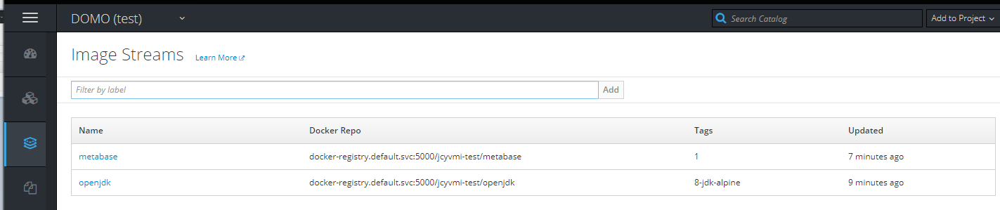

# Overview
This document is meant to provide a quickstart guide for setting up a [Metabase](https://metabase.com/) instance on your OpenShift environment to provide data analytics. It will provide an example path to get your data from a spreadsheet format to a Postgres database which Metabase will ingest from.

Following this quickstart will provide you with a short path to getting data from spreadsheet source, to being able to generate tabular and visual representations of your questions about the data and share with others.

Much of the setup done here on OpenShift is manual and if this configuration fits your needs could be integrated into your automated pipeline in accordance with your pipeline setup.

This process was documented from a session with Julian Subda of the EPIC team.

# Prerequisites
This guide assumes that your team has previously set up your OpenShift instances in accordance with the standard Exchange Lab model. <https://developer.gov.bc.ca/How-to-Request-a-New-OpenShift-Project>

It assumes you have some data in a fairly normalized tabular format (Excel spreadsheet, CSV file, etc) that will be able to be saved or copied to CSV in order to import into the database.
A sample data sheet is provided along with this documentation that can be used to follow the steps

# Database Setup
This guide uses a [PostgreSQL](https://www.postgresql.org/) database to store the data to be analyzed by Metabase. This example manually imports a version of Postgres from the catalog.

## Add PostgreSQL to your OpenShift Project

From the OpenShift web console, click to the Browse Catalog option and Filter to search for "PostgreSQL". Select the item that is just labelled "PostgreSQL" to add to your project.


This will bring up the import wizard. Click next on step 1 and then in step 2 you can leave the values as default, other than to specify a username and strong password for yourself.
For the purposes of the remainder of this documentation the username and pw entered here will just be **admin** and **password123**.


As this is a demo setup, the *sampledb* default database name will suffice. For your setup you can choose a more appropriate name if desired.  
The default *public* schema will be used as well. You can adjust this if desired.

In the next step (step 3 - Binding) select `Create a secret in <your project name> to be used later` to store the credentials in your OpenShift project.


Finish through the wizard and wait until your new postgres deployment finishes and appears up.


## Connect Locally to PostgreSQL Database
After your new database is up and running you can test out the connection from a local terminal. This can be accomplished by running `oc rsh` to shell into the pod where the DB is running and using the supplied [PSQL](https://www.postgresql.org/docs/9.6/app-psql.html) command line interface. If you wish to manage your database through a GUI (such as DBeaver or Azure Data Studio) you can forward the connection port via `oc port-forward -n NAMESPACE POD_NAME 15432:5432` and use your DB management application of choice. This demo will just rsh to the pod and use PSQL.

Go into the pod and take note of the pod ID (postgresql-1-2x88m in the screenshot below) for use in the next step. Note the environment variables available in the container. These are the DB name and connection details you set up in a previous step.


From a terminal, connect to your OpenShift project and rsh into the pod.

``` 
> oc login https://console.pathfinder.gov.bc.ca:8443 --token=YOUR_TOKEN
> oc project YOUR_NAMESPACE
> oc rsh POD_NAME 
```

This gets you into the pod and from there you can test connecting to the DB with the environment variables.

``` 
sh-4.2$  psql -U $POSTGRESQL_USER -d $POSTGRESQL_DATABASE
```

This should bring up the PSQL shell (see link above for how to use if you're new to it) and you can double check connection details

```
sh-4.2$ psql -U $POSTGRESQL_USER -d $POSTGRESQL_DATABASE
psql (9.6.10)
Type "help" for help.

sampledb=> \conninfo
You are connected to database "sampledb" as user "admin" via socket in "/var/run/postgresql" at port "5432".
sampledb=>
```

# Data Setup and Loading
Now that you have a DB setup in your OpenShift project you are ready to load your tabular data into that DB. This example will use a very simple dataset that can be found [here](sampleData/SampleData.csv) if you wish to follow along, with notes on more complex source data at the bottom of this section.

## Convert to CSV if necessary
If you have your source data in an Excel (or other type of) spreadsheet the first step is to save it as a CSV. If your data is in multiple tabs of a single spreadsheet, save each one as a CSV.

Ensure that the **column names** do not have any spaces in them and adjust if necessary. You can replace them with - or _. Consider doing this in Excel with a formula prior to CSV save if you have a lot of column names that need adjusting.


## Create Table(s) in Database
For each distinct dataset involved there will be a PostgreSQL table created to hold the data. This documentation will show a manual create->copy process but there may be tools available to shorten this if you need. For example, if using DBeaver you may be able to create the table from the CSV file <https://justnumbersandthings.com/post/2018-06-12-dbeaver-import-csv/>.

### 1. CREATE TABLE script
Make a CREATE TABLE postgres script corresponding to the CSV file you will be loading. Ensure the column names in the table exactly match the headers in the first row of the CSV.  
The data types can potentially be set to all string (varchar with appropriate length) values, though determining accurate data type values an ensure the fullest functionality in metabase.

There are options for auto-generating the create script for you. There are many on the web at the moment. See the important note below if going this route. One such example is [SQLizer](https://sqlizer.io/csv-to-mysql/). To use this, you can upload your CSV and it will make the appropriate CREATE TABLE script for the selected database type. If you supply the data it will intelligently determine data types as well.

**Important Note**  
**If you elect to use an online tool to autogenerate a script *do not* include any sensitive or personal information in the dataset being uploaded.**  
**For any tool being used, if potentially sensitive data is included, you must ensure all generation is done client side, on your computer. Be absolutely sure no API is being sent the data that you are transforming.**

Since this is irrelevant sample data, SQLizer was used with the entire contents of the data sheet to create the SQL script below.  
This tool will also create INSERT scripts for every row, but this is not manageable if the data set is large, so this will follow the PSQL COPY command in an upoming section.

```sql
CREATE TABLE "SampleData" (
    "OrderDate" TIMESTAMP,
    "Region" TEXT,
    "Rep" TEXT,
    "Item" TEXT,
    "Units" INT,
    "Unit_Cost" NUMERIC(6, 3),
    "Total" NUMERIC(7, 3)
);
```
### 2. Create the Table
Run this script from above in the PSQL command line on the pod (see *Connect Locally to PostgreSQL Database* section above on connecting with a shell) to have the table created.  
You can check the table got in after with the `\dt` command.

```sh
sampledb=> \dt;

          List of relations
 Schema |    Name    | Type  | Owner
--------+------------+-------+-------
 public | SampleData | table | admin
(1 row)
```

### 3. Copy CSV to Pod and Invoke COPY Command to Bulk Insert

Since the newly created table and the CSV file have the same column names/header names, the COPY command in PSQL can bulk insert all the data. To do this the location the PSQL shell is executing in must be able to see the CSV file to insert. Since this is remoting in to the pod to run PSQL, the file must be copied up to the pod to accomplish this.

**Note**: This can be accomplished other ways as well. If you elected to use a DB management software to connect it may have a bulk load functionality.  
You could also port forward the postgres connection to run PSQL on your local machnine and try the copy there if you don't wish to move the files up to the server.

`oc rsync` is used to copy the directory holding your CSV files (just the 1 in this example) up to the pod. In this example there is a folder called "metabaseSample" in the directory where the oc command is being run.  
The /tmp/ directory on the pod will be used.

```
> oc rsync ./metabaseSample POD_NAME:/tmp/                                     
sending incremental file list
metabaseSample/
metabaseSample/SampleData.csv

sent 2,296 bytes  received 39 bytes  1,556.67 bytes/sec
total size is 2,152  speedup is 0.92

> oc rsh POD_NAME                                                             
sh-4.2$ cd /tmp/metabaseSample/
sh-4.2$ ls
SampleData.csv
```

Then log back in to the PSQL shell and use COPY to insert the contents of the file to the relevant table.

```sql
sampledb=> \COPY "SampleData" FROM '/tmp/metabaseSample/SampleData.csv' WITH CSV HEADER; 
COPY 43

sampledb=> SELECT COUNT(*) FROM "SampleData";  
count
-------
    43
```
The count after the /COPY shows that all 43 rows in the sample data were inserted.

### 4. Create a Read-only User
The user being used to connect to PostgreSQL that you created earlier has administrative write access and as best practice should not be used by Metabase to connect to the DB. Since Metabase only needs to read data from your DB to run analytics it can access with a read-only user.

Log back in to PSQL as above and create a user and grant them SELECT access to the public schema (or whatever schema you created if different). Choose a strong password.

```sql 
sampledb=> CREATE USER readonlyuser WITH PASSWORD 'PASSWORD_HERE';

sampledb=> GRANT SELECT ON ALL TABLES IN SCHEMA public TO readonlyuser;
```

You should store this username and password in a new OpenShift secret to access it later. It will be manually entered in the Metabase Setup

# Metabase Deployment
The Metabase container will be built and deployed on your OpenShift project. This example continues a manual setup (using existing build and deployment configs) for brevity, but you may wish to integrate this into your exising or new pipeline process as typically done for lab projects.  
The build will be done in the same project as the deployment, but if integrating into your pipeline you would likely be using your **Tools** namespace for the build.

The *eagle-helper-pods* repository provided by Julian Subda is the [original source](https://github.com/bcgov/eagle-helper-pods/tree/master/openshift/templates/metabase) of the bc and dc files required here. They are reproduced and tweaked for the project in this example in the repository that contains this readme.
See [TBD link here (will point to final repo)](TBD) for the files you will use.

## Create Build Config
Fetch the build config file ([here](metabase.bc.json)) familiarize yourself with it and edit it.

At the top alter the "metadata.name" property to reflect your project acronym (instead of domo-metabase).

Alter the "SUFFIX" parameter near the bottom to reflect your acronym (instead of domo).

The docker image for the metabase build is supplied at the https://github.com/bcgov/eagle-helper-pods repository. Though you could move this to your repository if desired.  
See the *SOURCE_REPOSITORY_URL* and *SOURCE_CONTEXT_DIR* attributes in the build config and modify these to point to your repo structure if you are going that route.

Add the build config to your OpenShift project and process it. The values in the Template Configuration step can be left as is.


Check on the build to see when it is successful.


And you should have the tagged image (as well as the openjdk) in your images.


## Create Deployment Config
In the same manner import the deployment config ([here](metabase.dc.json)) with some customization.

At the top alter the "metadata.name" property to reflect your project acronym (instead of domo-metabase).

Set the "ENVIRONMENT_NAME" parameter to the appropriate namespace environment you are using (dev, test, prod).

Set the "APPLICATION_DOMAIN" parameter to the desired domain.

Alter the "SUFFIX" value to reflect your acronym.

Alter the "TOOLSNAMESPACE" value to reflect the namespace the build was done in. Since in this example the build is just being built in the same namespace as the deployment (jcyvmi-test in the DOMO example) this would be set to that namespace.

Process the template, and in the next step fill in an appropriate email for the Metabase admin user. 
Leave the other starred values blank and let Metabase generate.

## Go to the Metabase Dashboard
Wait a few minutes for the deployment to complete. It may look like the pod is up, but the Metabase may still be configuring itself and not completed.  
You can check the pod logs to see status of Metabase startup.


Once some time has passed click the URL to the Metabase site.  
You should see the getting started page


# Metabase Setup
Click *Let's get started* and follow through the setup pages.  
In step 1 set up yourself as the administrator.


In step 2 select PostgreSQL as your database type, and for the Name you can enter whatever you want to refer to the database collection as.

For the Host, you will select the Service Name referring to the database set up. This will be "postgresql" in this example, but to confirm (or if it was set to something else) you can check the Services list in the OpenShift Console.


Leave the port as 5432 (can confirm on the services page).

Enter the Database Name as "sampledb", which was used in this example. If you used a different DB name in the setup enter it there

For the username and password for the database **use the read-only user** for the database you created and granted access to in an earlier step.

.

In step 3 choose if you want to send anonymous usage stats and complete the setup.

# Using Metabase
You are set up in Metabase now and should be able to navigate around the Metabase console.

This guide is not meant to be a comprehensive guide to using Metabase's features, that is better served by the [documentation](https://metabase.com/docs/latest/) provided by Metabase. However a few things to get you started are provided below.

## Analyze Sample Data
The sample dataset you imported was put into a data collection you called MetabaseQuickStart during the setup wizard (unless you chose another name). It can be accessed at the bottom of the main consle under OUR DATA.  
Metabase also provides a pre-made "x-ray" of the new table in the collection featuring some auto generated charts and readings. See TRY THESE X-RAYS BASED ON YOUR DATA at the top of the main console.

.

Then you can click on the *Sample Data* table once in the MetabaseQuickStart collection, which will display the data in the table you imported as part of this documentation.  
From there you can ask questions about the data, generate visualizations and more. Refer to the Metabase documentation for the many features available once analyzing a data table.

Once you create questions and visualizations you can then to dashboards and collections that you can share with other users in metabase.

## Add Other Users
From the Admin panel you can invite other users.

.

From there select the *People* tab and click *Add someone*. This allows you to create a Metabase local user (stored in Metabase, not associated with an IDIR or OpenShift user) and send an invite.  

From the Metabase Admin screen you can use the *Permissions* tab to manage access to users or groups of users to the collections you set up to allow finer grained access control. See the Metabase documentation on [managing users](https://metabase.com/docs/latest/administration-guide/04-managing-users.html) for more details. 

# Next Steps
You have set up a quick Metabase instance pulling your data from a PostgreSQL database and configured user access to view and analyze this data.  
This may be enough to fit your needs for a quick view into data you have transferred from existing CSV (or other) data sources, but if you wish to have a robust Metabase setup there are additional steps worth considering.

## Embed Dashboards in application
TBD
https://www.metabase.com/docs/v0.24.1/administration-guide/13-embedding.html

## Transfer Metabase 

